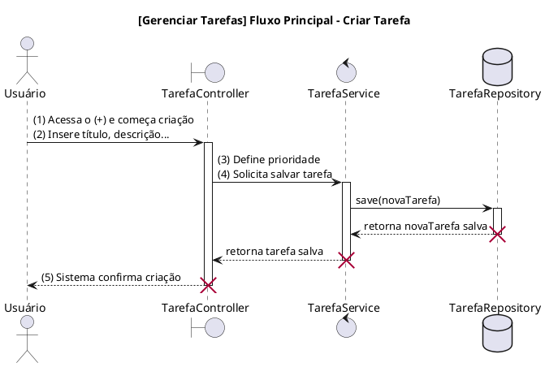
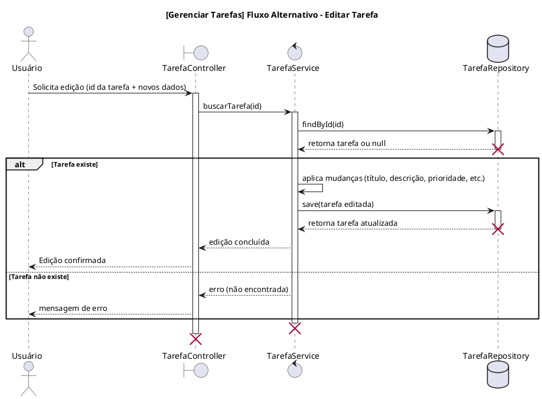
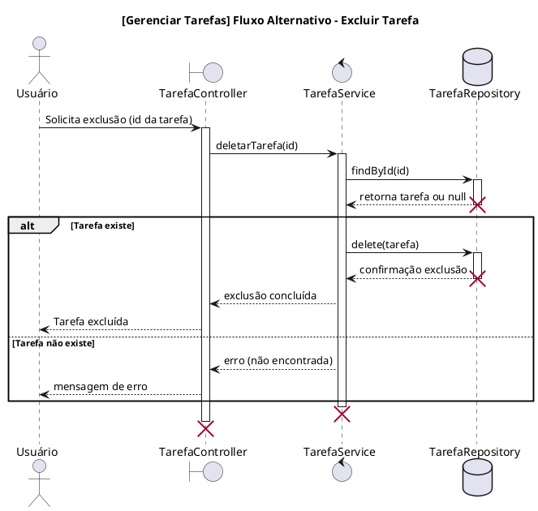
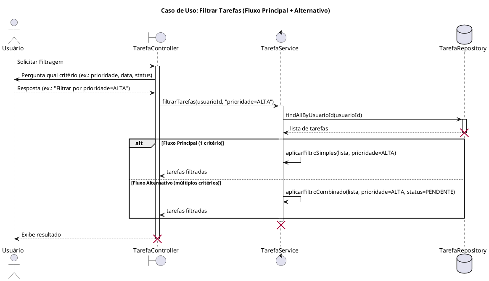
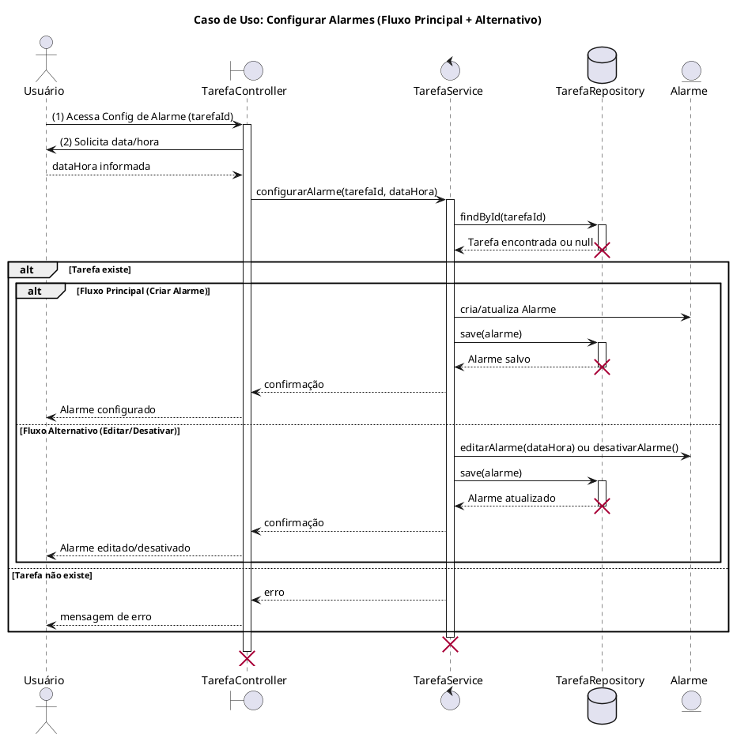
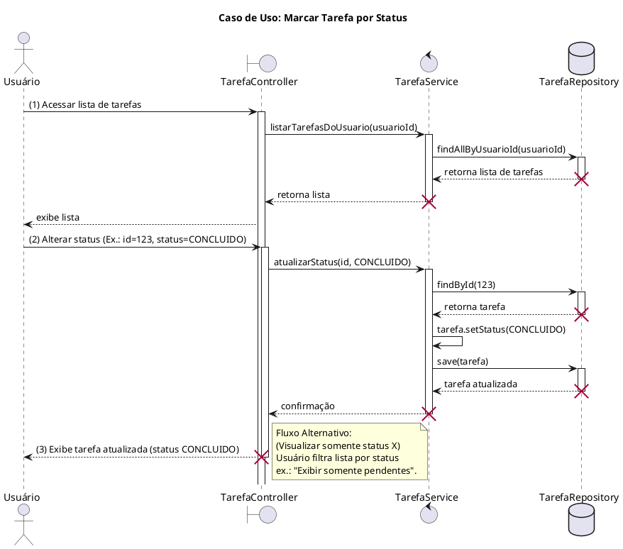
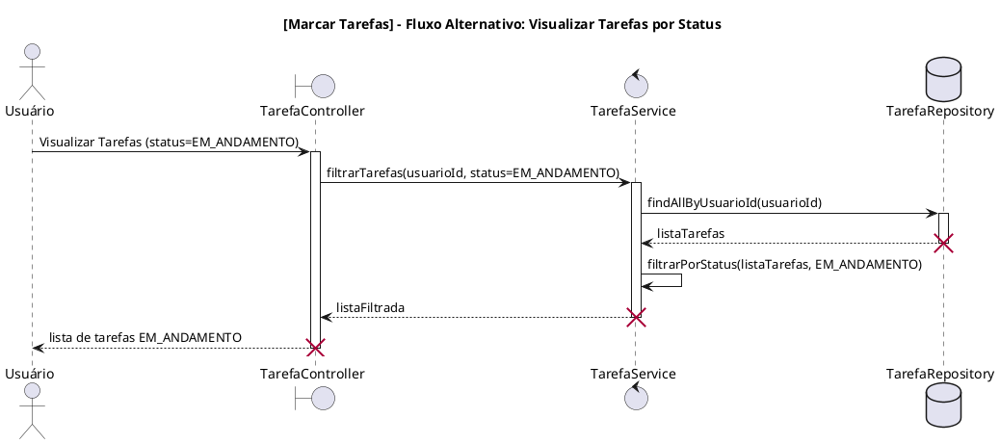

# Diagramas de Sequência - Aplicativo de Gestão de Tarefas e Compromissos

## 1. Gerenciar Tarefas
### 1.1. Fluxo Principal

### 1.2. Fluxo Alternativo - Editar Tarefa

### 1.3. Fluxo Alternativo - Excluir Tarefa

## 2. Filtrar Tarefas

## 3. Configurar Alarmes

## 4. Marcação de Tarefas por Status
### 4.1. Fluxo Principal

### 4.2. Fluxo Alternativo - Visualizar Tarefas por Status
