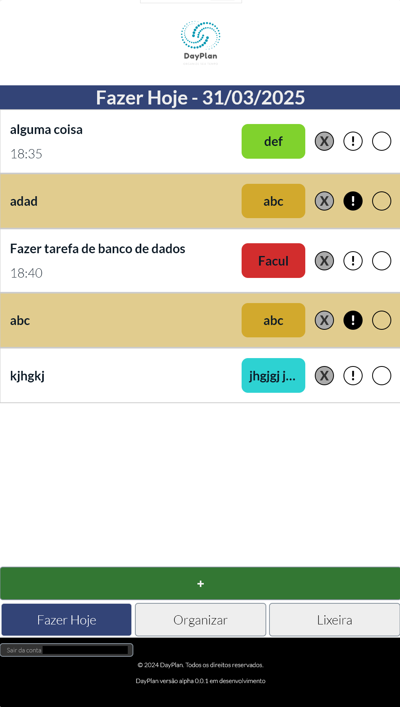

# DayPlan - Organize your time

DayPlan is a minimalistic planner for your day to day needs of keeping up with everything going on in your life. This is not, and will never be, an app with a thousand features that you will use for a couple weeks then forget about it. DayPlan offers a straight forward tool for you to prioritize what you need to do and always know what do you need to do NOW.

You can create an account and start using DayPlan alpha version on https://www.dayplan.com.br. Please send feedback as issues in this repository.

## Video Demo

Demonstration here, recorded on version `alpha v0.0.1-Hotfix1`: 

https://drive.google.com/file/d/1dmN4STTQ-c5m98YIBbw5wlnJWtUlDnc8/view?usp=sharing

### Summary:
- Developer experience:
    - Lint & TS rules, improvements to build
    - Package scripts
    - To start developing, run `npm run start`. You must have an aws cli profile named `DayPlanAdmin` configured. You can run this on any AWS account.
    - To update the app, make a PR to merge to `app-dev`. After I approve it and test it I will merge to `app-prod`.
    - The `landing-page` branch is the old placeholder landing page this repo had and is deployed to GitHub Pages.
- Features:
    - You can create a new task in Today's list ("Fazer Hoje") or Backlog ("Organizar"). The gray `X` or `+` moves each task between these lists.
    - A task can have priority, which you can set during creation, or by clicking `!` or by editing the task after clicking on it. This makes it highlighted in the list.
    - You complete a task by clicking on the last circle button to its right. You can also click again to un-complete it.
    - Upon completion, a task without a recurrence rule goes to the Done list ("Lixeira") and is automatically deleted after 20 days. You can also delete a task from its edit view or by clicking the red `X` in "Lixeira".
    - Recurrence rules are not yet implemented. They will be by number of days, days of the week and/or days of the month. Upon completion, a task with a recurrence rule is sent to the Backlog. It shows as completed during the day it was completed, then it is shown cleared, ready to be completed again. On days the recurrence rule matches, the task will be automatically moved to Today.
    - When un-completed, tasks move back to Today (no recurrence). Tasks with recurrence stay in the Backlog, unless today matches the rule in which case they will be moved to Today. 
    - The only mandatory fields of a task is its title and category.
    - Categories are assigned a color generated from a set of colors to provide background/highlight colors with equally spaced hue to make them easily discernable. If you have a lot of categories, new colors are automatically generated (changing all existing colors to maintain equal hue spacing). During creation or editing of a task you can search and/or select from the dropdown an existing category or you can just type in a new one.
    - The parameters of color generation will be exposed in a future feature and persisted in the database for the user.
    - The creation and edit views use the category's color in: the dropdown of existing categories, the priority switch (mimicking what it looks like in the list views!) and the big create/update button at the bottom.
    - You can reorder tasks within a list to prioritize them. On non-touch devices (i.e. desktop) you reorder them by dragging them. For touch devices (i.e. phones), for now, you will see buttons to move them one slot up or down at a time. Dragging for touch will be fixed in a future feature and those buttons will go away.
    - You can set a time for a task. This has no automated functionality, it is just to help you organize yourself. It is shown on the list views below the task's title.
    - The task's description is only available to be seen after creation on the edit view, this is to be used if you need to store some extra details on the task that doesn't need to clutter the list views.
    - The task's title has a limit of 100 characters, the category 20 and the description 200.
    - You can set a date and time for the task to automatically go to Today (without recurrence).
    - You can set a date and time for the task to automatically become a priority.
    - The fields for time and both the date&time have an `x` in them to reset them back to blank.
    - In the edit view you can also see the date and time when a task was created and last updated.
    - You can close the task creation and the edit views by either clicking their `x` at the top right or by navigating to one of the lists.
    - In the Done ("Lixeira") view, you have a button to delete all tasks at once.
    - Every time you click to delete a task, you will get a default browser confirmation dialog. This will turn into a proper modal popup in a future feature.
    - You can log out by clicking the button at the footer of the app.
    - You can navigate back to the landing page by clicking the logo at the top.
    - Create a secure account straight from Amazon's AWS services, log into it and start DayPlanning within seconds.
- To-dos:
    - There are a lot of them in the code...
    - Improve the UI design, matching the landing page's mock or better.
    - Make it an installable mobile app without the header/footer.
    - User Profile view, with their optional picture as the button to go there, where they will find their personal information, password and other settings configurable.
    - Improve icons, replace the character placeholders on them.
    - Implement alarms, to send notifications to the user when they choose to about a task.
    - Implement filtering options for the list views, in a very minimalistic way, only the useful stuff.
    - Implement being able to see tomorrow's task at the end of today's (based on recurrence rules and the configurable move to today date&time).
    - Implement a voice assistant (this is mostly a nice to have, it might happen in the far future).
    - Implement integration to external calendar links, configurable from the user profile page, to automatically import to Today's and tomorrow's list what you have on your other calendars/apps.
    - Implement unit and e2e tests with jest and cypress.
    - Implement SSO (single sign on) using other popular identity providers like Google, Microsoft, Apple, etc.
    - Implement a proper error popup for error alerts and confirms.
    - Make the color generation stable with the order that each category was created, so that the colors of existing categories do not change when tasks are created or deleted, which results in them being generated in different order.

### Stack

The frontend is basically Vite + React + Typescript. Styled components, sass, eslint, prettier are secondary important tools. Jest and cypress to be implemented. 
The backend and a lot of components for the frontend come from AWS's Amplify, an amazing tool and service that allows you to define your whole backend in a surprisingly extremely easy way, straight from the same repo as the frontend. I am only using Auth and Data stacks from Amplify but you can do a lot with it, even write custom lambda APIs. Auth uses AWS Cognito to provide your users with account signup and login. Data takes a schema and automatically builds for you a DynamoDB, graphql APIs and a frontend client to use all of it easier than making a cup of coffee. Giving only the taks's owner permissions to CRUD it is literally one line of code! Kindda crazy if you ask me.
